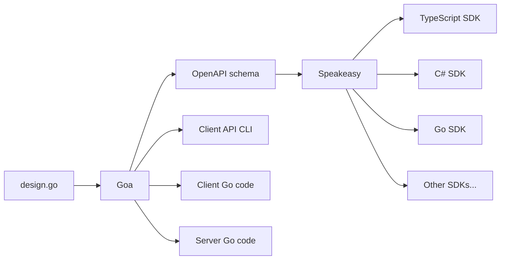

import { Callout } from '~/components';

- [Generate SDKs with Goa](#generate-sdks-with-goa)
	- [Is this tutorial right for you?](#is-this-tutorial-right-for-you)
	- [Prerequisites](#prerequisites)
	- [Introduction to Goa](#introduction-to-goa)
		- [Other Go OpenAPI frameworks](#other-go-openapi-frameworks)
		- [Tsoa](#tsoa)
	- [Create the API specification in Goa](#create-the-api-specification-in-goa)
		- [Download the example repository](#download-the-example-repository)
		- [Google's protocol buffers](#googles-protocol-buffers)
		- [Setup Go](#setup-go)
		- [Review the Goa design file](#review-the-goa-design-file)
			- [References ($ref)](#references-ref)
			- [Custom operationId](#custom-operationid)
			- [Tags](#tags)
			- [Extensions (custom fields)](#extensions-custom-fields)
		- [Generate the API code with Goa](#generate-the-api-code-with-goa)
			- [Explore the generated files](#explore-the-generated-files)
		- [Run the server and CLI](#run-the-server-and-cli)
	- [Create the API with Speakeasy](#create-the-api-with-speakeasy)
		- [Set up the Speakeasy CLI](#set-up-the-speakeasy-cli)
		- [Build an SDK](#build-an-sdk)
		- [Retries](#retries)
	- [Next steps](#next-steps)
		- [Get help with advanced Goa](#get-help-with-advanced-goa)
		- [Use Speakeasy customizations](#use-speakeasy-customizations)
	- [Todo](#todo)

# Generate SDKs with Goa

This tutorial explains how to define an application programming interface (API) service written in Go with Goa, convert it to an OpenAPI schema with Goa, and convert that to software development kits (SDKs) in multiple languages with Speakeasy. (OpenAPI used to be known as Swagger, which is now a set of tools that can be used with OpenAPI schemas.)

Below is a graphical summary of the creation process you will follow.



We will talk you through creating a complete code example. By the end of the tutorial you will have a working API service running in Go that you call through Typescript code in an SDK.

## Is this tutorial right for you?

If you're new to OpenAPI, Go, Goa, or Speakeasy, this is the perfect tutorial to work through to see if they are the appropriate technologies for your service.

If you definitely want to use your OpenAPI schema as a starting point, and not Go code that is transpiled into a schema, Goa is not the right choice for you. Rather choose one of the other [Go frameworks](#othergos) below.

You also might want to design your schema without choosing any programming language. In this case you could start with the [Swagger schema editor](https://swagger.io/tools/swagger-editor/). However, using Goa's elegant design language is a lot simpler than trying to design your schema manually. It also creates all the HTTP and gRPC transport code for you.

## Prerequisites
For this tutorial you need only Docker, version 20 or greater. You can complete this tutorial on Linux, Mac, or Windows since Docker commands are not dependent on your operating system or any installed frameworks.

If you are running on Windows, please replace backslashes with forward slashes in the few places where we refer to a folder path on your host machine.

## Introduction to Goa

[Goa](https://goa.design/learn/getting-started/) is a package written in the Go language that allows you to define an API in Go syntax using functions from the Goa design language. Goa uses your definition in its `design.go` file to create
- an OpenAPI schema that can be used by programmers, or tools like Speakeasy, to understand your API,
- Go code for a client application to call your API,
- a command line interface (CLI) to call your API,
- the transport-agnostic code to provide the API on a server over protocols like HTTP and gRPC,
- Go code stubs for the service itself, that you can complete with business logic.

### Other Go OpenAPI frameworks
{: #othergos}

Most other Go frameworks generate Go code from an existing OpenAPI schema, and don't allow you to write Go as a starting point. These include:
- [Deepmap's OpenAPI code generator](https://github.com/deepmap/oapi-codegen)
- [Ogen](https://github.com/ogen-go/ogen)
- [Swaggest's OpenAPI structures for Go](https://github.com/swaggest/openapi-go)

[Swaggest Rest](https://github.com/swaggest/rest) can generate OpenAPI definitions from Go code, but is not as comprehensive as Goa and does not support gRPC.

### Tsoa
[Tsoa](https://github.com/lukeautry/tsoa) is a popular Typescript framework similar to Goa that you may encounter in the OpenAPI ecosystem. Speakeasy has a [tutorial](/docs/api-frameworks/tsoa) for it too.

Goa was created in 2015 and Tsoa in 2016. While Tsoa uses decorators and can work with normal Express.js code, Goa starts with an abstract design document in its domain specific language (DSL) and uses that to generate code and schemas.

## Create the API specification in Goa
Now that you understand how Goa and Speakeasy are used, let's write some code.

### Download the example repository
First clone the <a href={frontmatter.url}>example repository</a> using the code below. If you don't have git, you can download the code and unzip it.

```bash
git clone https://github.com/ritza-co/speakeasy-goa-example.git;
cd speakeasy-goa-example;
```

While you will be creating a demonstration application in the `app` folder in this tutorial, there is a folder called `completed_app` in this repository that has all the final generated code and executable files.

### Google's protocol buffers

Goa generates [gRPC](https://grpc.io/) code for you. gRPC is an efficient alternative to plain HTTP, over which you can provide your API. It requires the use of protocol buffers, made by Google. Our repository already provides the `protoc` app for you, in `completed_app/lib`.

To use more recent versions of `protoc` in future applications you write, download them from https://github.com/protocolbuffers/protobuf/releases.

### Setup Go

In a terminal inside the `speakeasy-goa-example` folder, run the commands below. Comments in the commands explain what they do.

```bash
mkdir app;
cd app;
cp completed_app/lib .; # copy protoc into your new app
cp completed_app/design .; # copy in a simple Goa design file

docker run --name gobox --volume .:/go/src/app -it golang:1.21.2 bash; # start Go in a container and share your app folder with it
```

You now have an `app` folder ready to code in, and are inside a terminal in a Go container called `gobox` in Docker.

<Aside>
If you leave this tutorial and return later, you can start the container and attach to the terminal, instead of rebuilding everything:

```bash
docker start gobox;
docker exec -it gobox bash;
```

If you need to delete the container and start over, run:

```bash
docker stop gobox;
docker rm gobox;
```
</Aside>

Run the following commands inside the gobox terminal.

```bash
cd src/app;
go mod init app; # create a new Go package in this folder called app
go install goa.design/goa/v3/cmd/goa@v3; # install Goa
go install google.golang.org/protobuf/cmd/protoc-gen-go@latest; # install grpc
go install google.golang.org/grpc/cmd/protoc-gen-go-grpc@latest;
export PATH=$PATH:/go/src/app/lib; # add protoc to your path
```

### Review the Goa design file

You now have Goa installed and ready to run against a Goa design file. Let's pause to review the API specification in `app/design/design.go`. Open the file now.

After importing Goa, the design starts by defining the top-level API:

```go
var _ = API("club", func() {
	Title("The Speakeasy Club")
	Version("1.0.0")
	Description("A club that serves drinks and plays jazz. A Goa and Speakeasy example.")
	Contact(func() {
		Name("Speakeasy Support")
		Email("None. Please use Slack.")
		URL("https://speakeasy-dev.slack.com/join/shared_invite/zt-1cwb3flxz-lS5SyZxAsF_3NOq5xc8Cjw")
	})
	Docs(func() {
		Description("The Speakeasy Club documentation")
		URL("https://www.speakeasyapi.dev/docs")
	})
	License(func() {
		Name("Apache 2.0")
		URL("https://www.apache.org/licenses/LICENSE-2.0.html")
	})
	TermsOfService("https://www.speakeasyapi.dev/docs/terms-of-service")
	Server("club", func() {
		Description("club server hosts the band and order services.")
		Services("band", "order")
		Host("dev", func() {
			Description("The development host. Safe to use for testing.")
			URI("http://{machine}:51000") // use the machine variable below
			URI("grpc://{machine}:52000")
			Variable("machine", String, "Machine IP Address", func() {
				Default("localhost")
			})
		})
	})
})
```

You see that everything in the Goa DSL is a function. The `API` function takes a function that runs other functions to specify parts of the overall definition of the API, such `Description`, `Version`, and the endpoints (URLs) of the server. To learn all the possible functions Goa provides, read the [DSL documentation](https://pkg.go.dev/goa.design/goa/dsl). To create a simpler — minimal — definition, read the [Goa getting start guide](https://goa.design/learn/getting-started/).

The example you are creating provides a virtual jazz club, allowing you to order a digital drink and change the genre of music played. These features are defined in two separate services, `order` and `band`. While the `club` API title corresponds to the server URL and is not visible, the service names are visible in URLs: `http://localhost:51000/order` and `http://localhost:51000/band`.

The definitions of the two services are below the API. Let's look at the drinks service.

```go
var _ = Service("order", func() {
	Description("A waiter that brings drinks.")
	Method("tea", func() {
		Description("Order a cup of tea.")
		Payload(func() {
			Field(1, "isGreen", Boolean, "Whether to have green tea instead of normal.")
			Field(2, "numberSugars", Int, "Number of spoons of sugar.")
			Field(3, "includeMilk", Boolean, "Whether to have milk.")
		})
		Result(String)
		HTTP(func() {
			GET("/tea")
		})
		GRPC(func() {
		})
	})
	Files("/openapi.json", "./gen/http/openapi.json")
})
```

Above you can see we've defined a single GET method, called `tea`, in the `order` service, that takes a few parameters about how you like your milk and sugar, and returns a string representing a cup of tea.

#### References ($ref)

Goa automatically moves complex types out of the service definition section into their own section in the schema. For example, in `design.go` the line `$ref: '#/components/schemas/TeaRequestBody'` refers the order specification for tea to the `components` section later in the document. This uses a JSON feature called [references](https://swagger.io/docs/specification/using-ref).

#### Custom operationId

If you can't find a function in the Goa documentation that corresponds to an OpenAPI field you are expecting, you can probably add it with the [`Meta`](https://pkg.go.dev/goa.design/goa/dsl#Meta) function. `Meta` will add a field and value to any object.

For example, here's how you can change the default `operationId` value for a method, which is normally `serviceName#methodPath`:

```go
Method("play", func() {
  Meta("openapi:operationId", "band#play2")
```

An operationId is a unique name to clearly identify an operation (method). They are useful to name and discuss operations in documentation and SDKs.

#### Tags

Speakeasy recommends adding [tags](https://swagger.io/docs/specification/grouping-operations-with-tags/) to all operations, so you can group operations by tag in generated SDK code and documentation. A tag is just a label, like a comment, that you can add to a method.

The [`Tag`](https://pkg.go.dev/goa.design/goa/dsl#Tag) function in Goa has a different meaning to in OpenAPI, so you need to use the `Meta` function again, in the `HTTP` section of a method.

```go
var _ = Service("band", func() {
	Method("play", func() {
		HTTP(func() {
			Meta("openapi:tag:Music operations")
```

#### Extensions (custom fields)

OpenAPI supports fields that are not in the specification. These [extensions](https://swagger.io/docs/specification/openapi-extensions/) allow you to add custom data to your schema that might have special meaning to applications like Speakeasy. They start with `x-`.

Speakeasy provides a set of [OpenAPI extensions](/docs/customize-sdks). For example, you may want to give an SDK method a name different from the operationId:

```go
Method("tea", func() {
  Meta("openapi:extension:x-speakeasy-name-override", "chai")
```

TODO
- use models instead of plain datatypes
- Retries.
- make schema look like Niels
- speakeasy to work with GET tea
- validate your schema

### Generate the API code with Goa

Generate the client and server code, and the OpenAPI schema from your design file, by running the commands below in the gobox container.

```bash
goa gen app/design;
goa example app/design;
```

The files created in the container will belong to the root user, and you will not be able to edit them on your host. So in a terminal on your host machine in the app `folder`, give yourself permissions to edit the created files:

```bash
sudo chown -R $(id -u):$(id -g) .
```

Rerun this whenever you create a file in the container.

#### Explore the generated files

Goa has written a lot of code for us. Below is everything created under `app`, and what it does. To avoid duplication, there is only an explanation for the band files, not for the order files, because they are both services and are structured identically.

The following files and folders are created by `goa gen`, and you may regenerate them when your `design.go` file changes. You may not edit them manually.

- `/gen` — Contains all definition and communication code for HTTP, gRPC, and schemas. Think of the `gen` folder as your `definitions` folder.
- `/gen/band` — Contains transport independent service code.
- `/gen/band/client.go` — Can be imported by client code to make calls to the server.
- `/gen/band/endpoints.go` — Exposes the service code to the transport layers.
- `/gen/grpc` — Contains the server and client code which connects the protoc-generated gRPC server and client code, along with the logic to encode and decode requests and responses
- `/gen/grpc/band/pb` — Contains the protocol buffer files that describe the band gRPC service.
- `/gen/grpc/band/pb/goagen_app_band_grpc.pb.go` — The output of the protoc tool.
- `/gen/grpc/cli` — Contains the CLI code to build gRPC requests from a terminal.
- `/gen/http` — All HTTP related transport code, for server and client.
- `/gen/http/openapi3.yaml` — The OpenAPI version 3 schema (next to .json schemas, and version 1 schemas)

The following files and folders are created by `goa example`. They are a starting point to write your business logic implementation and tests for your server. You may **not** regenerate them when your `design.go` file changes. Rather update them manually. If you haven't started work on your implementation yet and do wish to regenerate the files, delete the existing files first to be certain that Goa recreates them.

- `/cmd` — Contains working placeholder server and CLI code. Think of the `cmd` folder as your `implementation` folder.
- `/cmd/club` — A Go package containing your API that you can compile and run to have a working server.
- `/cmd/club/main.go` — The server placeholder implementation that you can change to your liking. Add your favorite logger and database manager here.
- `/cmd/club-cli` — A Go package containing a CLI tool that you can compile and call from the terminal to make requests to the server above.
- `band.go` — A placeholder implementation of your service. You can write your actual business logic here. You might think this file belongs in the `/cmd/club` folder with the API implementation, instead of in the root of the project.

### Run the server and CLI

Goa has given us a simple, but working client and server implementation. Let's compile and test them before starting with Speakeasy.

Run the code below in the gobox container.

```bash
go get app/cmd/club; # download dependencies
go build ./cmd/club && go build ./cmd/club-cli;
```

You now have two executable files in the `app` folder, called `club` and `club-cli`.

Run the Club server in a terminal on your host machine:
```bash
./club
```

In another terminal on your host, call the server using the CLI:

```bash
./club-cli --help;
./club-cli order tea --body '{"includeMilk": false, "isGreen": false, "numberSugars": 1 }';
./club-cli band play --body '{"style": "Bebop" }';
```

While the CLI won't receive a response from the server because the implementation is just a placeholder, you can see in the server terminal that it has been successfully called. Stop the server by pushing <kbd>Ctrl+C</kbd> in the terminal window.

## Create the API with Speakeasy

Speakeasy is an online-only service. Please register before continuing this tutorial, at https://app.speakeasyapi.dev. Once you've registered, create a workspace named `club`. Browse to API keys. Click `New Api Key`. Name it `club`. Copy and save the key content to use later.

### Set up the Speakeasy CLI

The CLI is the simplest way to use Speakeasy. This tutorial uses Docker, but if you want to install Speakeasy directly on your computer in the future, follow the instructions in the [readme](https://github.com/speakeasy-api/speakeasy#installation).

Run the commands below in a terminal on your host machine.

```bash
docker run --name speakbox -v ./app:/app -it alpine:3.18.4 sh
```

In the container called speakbox that starts, run the code below. Use your API key that you saved earlier in the last line.

```bash
apk add curl unzip sudo; # install dependencies
curl -fsSL https://raw.githubusercontent.com/speakeasy-api/speakeasy/main/install.sh | sh; # install Speakeasy

export SPEAKEASY_API_KEY=your_api_key_here; # <-- overwrite this with your key
```

Now Speakeasy is installed in the container. Test it by running:

```bash
speakeasy help;
```

<Aside>
If you exit the container and want to return to it later, run:
```bash
docker start speakbox; docker exec -it speakbox sh;
```
</Aside>

### Build an SDK
You now have `app/gen/http/openapi3.yaml` and Speakeasy. So you can build the SDK. In the speakbox container you started in the last section, run:

```bash
speakeasy generate sdk \
    --schema /app/gen/http/openapi3.yaml \
    --lang typescript \
    --out /app/sdk
```

Remember to give yourself permissions to the files on your host machine again:

```bash
sudo chown -R $(id -u):$(id -g) .
```

<Aside>
While we're using only TypeScript in this tutorial, Speakeasy supports: [C#, Go, Java, PHP, Python, Ruby, Swift, Typescript](/docs/create-client-sdks#language-support).
</Aside>

### Retries
/docs/customize-sdks/retries

## Next steps

### Get help with advanced Goa
If you want to build a more complex API and need help understanding Goa, read the full [design language specification](https://pkg.go.dev/goa.design/goa/dsl).

You can also use the Go Slack group to ask for help:
- Register for the group at https://invite.slack.golangbridge.org.
- Log in at https://gophers.slack.com.
- Join the Goa channel to ask questions about the framework.

But one of the fastest ways to find out how to do something, especially when using `Meta`, is to search the test cases, after cloning the [source code](https://github.com/goadesign/goa).

### Use Speakeasy customizations

Review the [Speakeasy customizations](https://www.speakeasyapi.dev/docs/customize-sdks) to see if adding any would make your service more understandable or usable.


## Todo
- review https://github.com/speakeasy-api/speakeasy
- https://github.com/goadesign/goa/issues/3390
  - Include link to - https://invite.slack.golangbridge.org/
  - Register for the group at https://invite.slack.golangbridge.org/.
  - Log in at https://gophers.slack.com/.
  - add pull request to getting started article.

- move goa go first explanation higher up, and give summary of what we are doing in the article for brand new users
- copy everything to completed_app
- check exe files into completed_app too
- change gitignore
- asides to callouts
- test everything
- https://gophers.slack.com/archives/C0FK8EV28/p1697635268483699

pull request to update goa docs https://pkg.go.dev/goa.design/goa/dsl that I can see.Tags: Meta("openapi:operationId", "band#play2")
OperationId: Meta("openapi:tag:Music operations")
Extensions: Meta("openapi:extension:x-speakeasy-name-override", "chai")