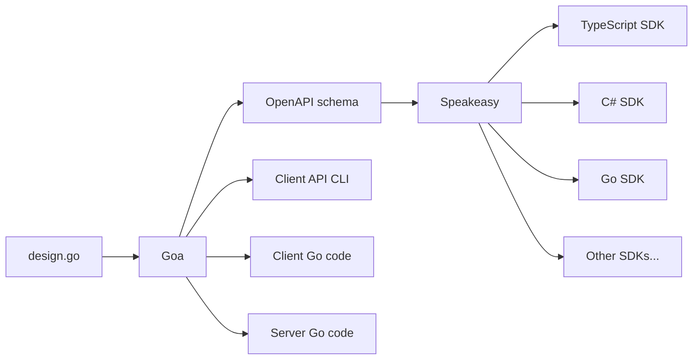

import { Callout } from '~/components';

- [Generate SDKs with Goa](#generate-sdks-with-goa)
  - [Prerequisites](#prerequisites)
  - [Introduction to Goa](#introduction-to-goa)
    - [Other Go OpenAPI frameworks](#other-go-openapi-frameworks)
    - [Tsoa](#tsoa)
  - [Create the API specification in Goa](#create-the-api-specification-in-goa)
    - [Download the example repository](#download-the-example-repository)
    - [Google's protocol buffers](#googles-protocol-buffers)
    - [Setup Go](#setup-go)
    - [Review the Goa design file](#review-the-goa-design-file)
    - [Generate the API code with Goa](#generate-the-api-code-with-goa)
  - [Create the API with Speakeasy](#create-the-api-with-speakeasy)
  - [Set up the Speakeasy CLI](#set-up-the-speakeasy-cli)
  - [Build an SDK](#build-an-sdk)
    - [Retries](#retries)
  - [Next steps](#next-steps)
    - [Get help with advanced Goa](#get-help-with-advanced-goa)
  - [Todo](#todo)

# Generate SDKs with Goa

This tutorial explains how to define an application programming interface (API) service written in Go with Goa, convert it to an OpenAPI (formerly known as Swagger) schema with Goa, and convert that to software development kits (SDKs) in multiple languages with Speakeasy.

Below is a graphical summary of the creation process you will follow.



We will talk you through creating a complete code example. By the end of the tutorial you will have a working API service running in Go that you call through Typescript code in an SDK.

## Prerequisites
You need only Docker, version 20 or greater. You can complete this tutorial on Linux, Mac, or Windows since Docker commands are not dependent on your operating system or any installed frameworks.

If you are running on Windows, please replace backslashes with forward slashes in the few places where we refer to a folder path on your host machine.

## Introduction to Goa

(If you are familiar with Goa you can skip ahead to the next section on building an API.)

[Goa](https://goa.design/learn/getting-started/) is a package written in the Go language that allows you to define an API in Go syntax using functions from the Goa design language. Goa uses your definition in its `design.go` file to create
- an OpenAPI schema that can be used by programmers, or tools like Speakeasy, to understand your API,
- Go code for a client application to call your API,
- a command line interface (CLI) to call your API,
- the transport-agnostic code to provide the API on a server over protocols like HTTP and gRPC,
- Go code stubs for the service itself, that you can complete with business logic.

### Other Go OpenAPI frameworks
There are other Go OpenAPI frameworks, but we do not recommend any of them over Goa.

Most frameworks generate Go code from an existing OpenAPI schema, and don't allow you to write Go as a starting point. These include:
- [Deepmap's OpenAPI code generator](https://github.com/deepmap/oapi-codegen)
- [Ogen](https://github.com/ogen-go/ogen)
- [Swaggest's OpenAPI structures for Go](https://github.com/swaggest/openapi-go)

[Swaggest Rest](https://github.com/swaggest/rest) can generate OpenAPI definitions from Go code, but is not as comprehensive as Goa and does not support gRPC.

### Tsoa
[Tsoa](https://github.com/lukeautry/tsoa) is a popular Typescript framework similar to Goa that you may encounter in the OpenAPI ecosystem. Speakeasy has a [tutorial](/docs/api-frameworks/tsoa) for it too.

Goa was created in 2015 and Tsoa in 2016. While Tsoa uses decorators and can work with normal Express.js code, Goa starts with an abstract design document in its domain specific language (DSL) and uses that to generate code and schemas.

## Create the API specification in Goa
Now that you understand how Goa and Speakeasy are used, let's write some code.

### Download the example repository
First clone the <a href={frontmatter.url}>example repository</a> using the code below. If you don't have git, you can download the code and unzip it.

```bash
git clone https://github.com/ritza-co/speakeasy-goa-example.git;
cd speakeasy-goa-example;
```

While you will be creating a demonstration application in the `app` folder in this tutorial, there is a folder called `completed_app` in this repository that has all the final generated code and executable files.

### Google's protocol buffers

Goa generates [gRPC](https://grpc.io/) code for you. gRPC is an efficient alternative to plain HTTP, over which you can provide your API. It requires the use of protocol buffers, made by Google. Our repository already provides the `protoc` app for you, in `completed_app/lib`.

To use more recent versions of `protoc` in future applications you write, download them from https://github.com/protocolbuffers/protobuf/releases.

### Setup Go

In a terminal inside the `speakeasy-goa-example` folder, run the commands below. Comments in the commands explain what they do.

```bash
mkdir app;
cd app;
cp completed_app/lib .; # copy protoc into your new app
cp completed_app/design .; # a simple Goa design file

docker run --name gobox --volume .:/go/src/app -it golang:1.21.2 bash; # start Go in a container and share your app folder with it
```

You now have an `app` folder ready to code in, and are inside a terminal in a Go container called `gobox` in Docker.

<Aside>
If you leave this tutorial and return later, you can start the container and attach to the terminal, instead of rebuilding everything:

```bash
docker start gobox;
docker exec -it gobox bash;
```

If you need to delete the container and start over, run:

```bash
docker stop gobox;
docker rm gobox;
```
</Aside>

Run the following commands inside the gobox terminal.

```bash
cd src/app;
go mod init app; # create a new Go package in this folder called app
go install goa.design/goa/v3/cmd/goa@v3; # install Goa
go install google.golang.org/protobuf/cmd/protoc-gen-go@latest; # install grpc
go install google.golang.org/grpc/cmd/protoc-gen-go-grpc@latest;
export PATH=$PATH:/go/src/app/lib # add protoc to our path
```

### Review the Goa design file

You now have Goa installed and ready to run against a Goa design file. Let's pause to review the API specification in `app/design/design.go`.


Your file `app/design/design.go` should now match the file `app/design/design_completed.go`.

### Generate the API code with Goa

```bash
goa gen app/design;
goa example app/design;
```

In your host machine terminal, not in the container terminal, give yourself permissions to edit the created files. Rerun this whenever you create a file in the container.

```bash
sudo chown -R 1000:1000 ./app;
```

In `order.go` set: `return "A nice cup of tea", nil`

Compile it in the container.
```bash
go get app/cmd/club; # download dependencies
go build ./cmd/club && go build ./cmd/club-cli;
```

Since Go compiles to executables, you can now run the Club server in your physical machine.
```bash
./club
```

In another terminal
```bash
./club-cli --help
./club-cli order tea --body '{"includeMilk": false, "isGreen": false, "numberSugars": 1 }' # A nice cup of tea
 ./club-cli band play --body '{"style": "Bebop" }' # No response
```

## Create the API with Speakeasy

Speakeasy is an online-only service. Please register before continuing this tutorial: https://app.speakeasyapi.dev. Once you've registered, create a workspace named `club`. Browse to API keys. Click `New Api Key`. Name it `club`. Copy and save the key content to use later.

Speakeasy supports these languages: [C#, Go, Java, PHP, Python, Ruby, Swift, Typescript](https://www.speakeasyapi.dev/docs/create-client-sdks#language-support).

## Set up the Speakeasy CLI

The CLI is the simplest way to use Speakeasy. This tutorial uses Docker, but if you want to install Speakeasy directly on your computer in the future, follow the instructions in the [readme](https://github.com/speakeasy-api/speakeasy#installation).


```bash
docker stop speakbox; docker rm speakbox;
docker run --name speakbox -v ./app:/app -it alpine:3.18.4 sh; # docker run --name speakbox -v ./app:/app -it ubuntu:22.04 bash;
apk add curl unzip sudo; # apt update; apt install curl unzip sudo -y;
curl -fsSL https://raw.githubusercontent.com/speakeasy-api/speakeasy/main/install.sh | sh;
```

Now Speakeasy installed. Test it by running:

```bash
speakeasy help;
```

Now add you API key that you saved earlier when registering with Speakeasy.
```
export SPEAKEASY_API_KEY=your_api_key_here
```

<Aside>
If you exit the container and want to return to it later, run:
```bash
docker start speakbox; docker exec -it speakbox sh;
```
</Aside>

## Build an SDK
You now have `app/gen/http/openapi3.yaml` and Speakeasy. So you can build the SDK. In the speakbox container you started in the last section, run:

```bash
speakeasy generate sdk \
    --schema /app/gen/http/openapi3.yaml \
    --lang typescript \
    --out /app/sdk
```

Remember to give yourself permissions to the files on your host machine again.

```bash
sudo chown -R 1000:1000 ./app;
```

validate your schema


### Retries
https://www.speakeasyapi.dev/docs/customize-sdks/retries

## Next steps

### Get help with advanced Goa
If you want to build a more complex API and need help understanding Goa, read the full [design language specification](https://pkg.go.dev/goa.design/goa/dsl).

You can also use the Go Slack group to ask for help:
- Register for the group at https://invite.slack.golangbridge.org.
- Log in at https://gophers.slack.com.
- Join the Goa channel to ask questions about the framework.

## Todo
- use models instead of plain datatypes
- review https://github.com/speakeasy-api/speakeasy
- https://github.com/goadesign/goa/issues/3390
  - Include link to - https://invite.slack.golangbridge.org/
  - Register for the group at https://invite.slack.golangbridge.org/.
  - Log in at https://gophers.slack.com/.
  - add pull request to getting started article.

- How can you customize the OpenAPI spec generated by Goa?
- What kind of customizations lead to better SDK generations

- operationId for each path.
- Use $ref instead of inline schemas for input/output.
- Speakeasy-specific OpenAPI extensions, for example, retries.
- Tags to organize code in the generated SDKs.
- check exe files into completed_app too
- asides to callouts
- test everything
- copy design.go to design_completed.go